# Chernobyl Tours

For this project, I have used HTML, CSS & Javascript(and no external libraries/frameworks) to put together a site that specialises in bespoke tours to the Chernobyl and Pripyat areas.

[Link to my deployed site with GitHub Pages](https://chloe-o.github.io/ms-project-two/)

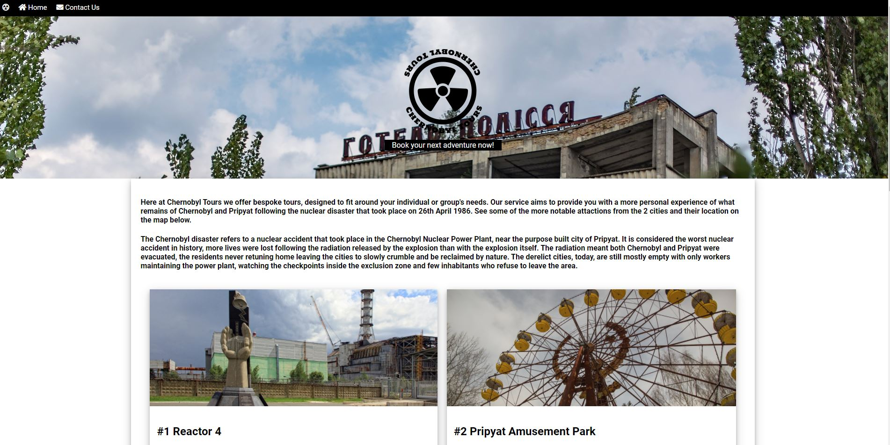

---

# User Experience (UX)

The purpose of the site is for a user to enquire about/ look to book a bespoke trip to Chernobyl and/or Pripyat. When travelling myself, I prefer to find out some basic information about my destination beforehand so I have incorporated some information about the areas so the user does not have to navigare away from the site to do this.

## User Stories

## First Time Visitor Goals

- As a first time user, I want to visit the site and know quickly what the purpose of the site is
- I want to be able to easily navigate around the site from any page without much(if any scrolling) or searching
- I want to be able to find out brief information about Chernobyl and Pripyat before enquiring further without being bombarded with information as the main purpose of the site is for booking a bespoke trip
- I want to enquire about a bespoke a trip without being limited to pre-set options i.e. pre-set route of tour
- I want confirmation that my query has been receieved by the operator when completely the enquiry form

## Returning Time Visitor Goals & Frequent Time Visitor Goals

- Due to the nature of the site I feel it is unlikely that a user would return to or become a frequent visitor to the site

## Design

## Colour Scheme

- The colour scheme is black and white, images and the header provide some colour
- Grey is used when hovering over buttons

## Typography

- Roboto from Google Fonts is the font used throughout the site

## Imagery

- Images are used throughout the site with an image used as part of the page's header, this stands out against the white background
- Following feedback from my first submission, I have edited the header image to create more contrast between the header image and site logo so the logo is easier to read and is not obstructed

## Wireframes

- I have created wireframes showing desktop views of all the site's pages and showing the home page on a mobile phone and tablet sized display

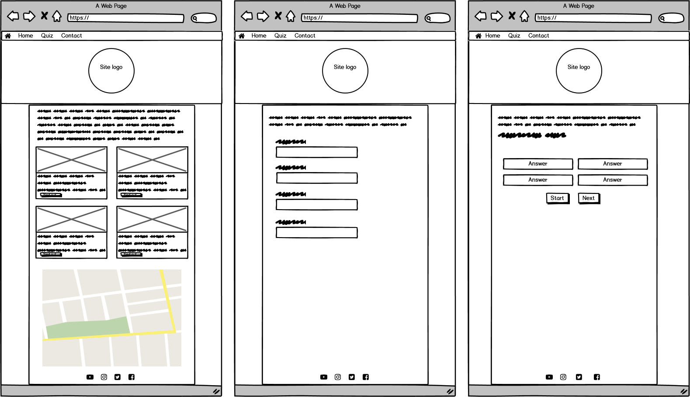

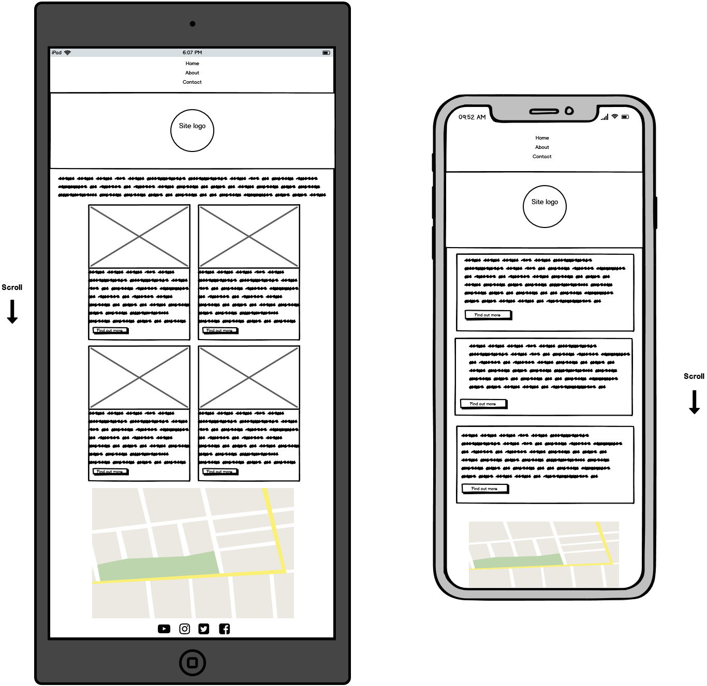

# Technologies Used

Languages used for this site:

- [JavaScript](https://www.javascript.com/)
- [HTML5](https://en.wikipedia.org/wiki/HTML5)
- [CSS3](https://en.wikipedia.org/wiki/Cascading_Style_Sheets)

## Frameworks, Libraries & Programs Used

1. [Google Fonts:](https://fonts.google.com/)
   - Google fonts were used to import the Roboto font which is used throughout the site
2. [Font Awesome:](https://fontawesome.com/)
   - Font Awesome was used on all pages throughout the website to add icons to the page
3. [GitHub:](https://github.com/)
   - GitHub is used to store the project, GitHub pages was used to publish the site
4. [Balsamiq:](https://balsamiq.com/)
   - Balsamiq was used to create the wireframes for the site

---

# Features

- Site is responsive on all device sizes, I have utilised media queries to acheive this
- Interactive elements are impleted on the sites using JavaScript in the form of: modals, Google maps, a short quiz
- Hovering over buttons and links provide visual feedback to the user
- The quiz page randomises a set of questions and provided visual feedback in the form of red or green buttons depending on the whether the user chooses the correct answer

---

# Testing

## Code Validation

The W3C Markup Validator and W3C CSS Validator Services were used to validate every page of the project to ensure there were no syntax errors in the project.

### HTML

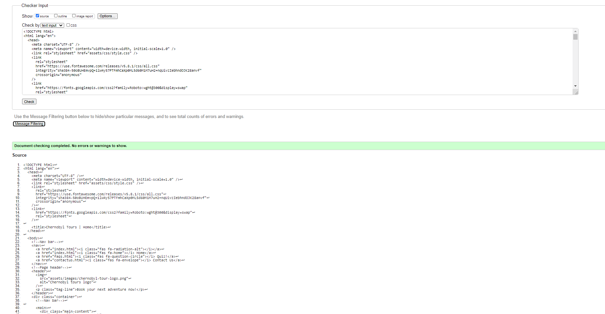
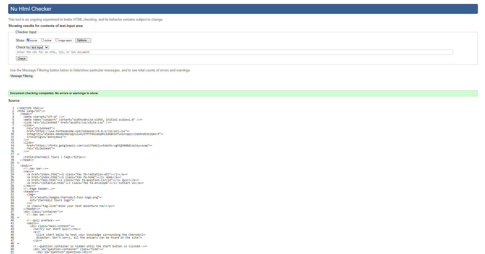
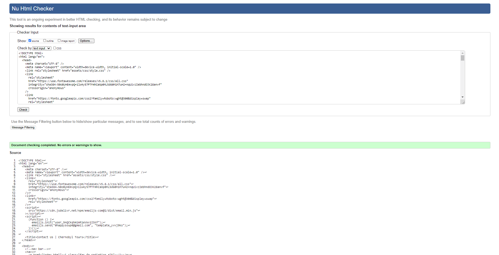

---

### CSS

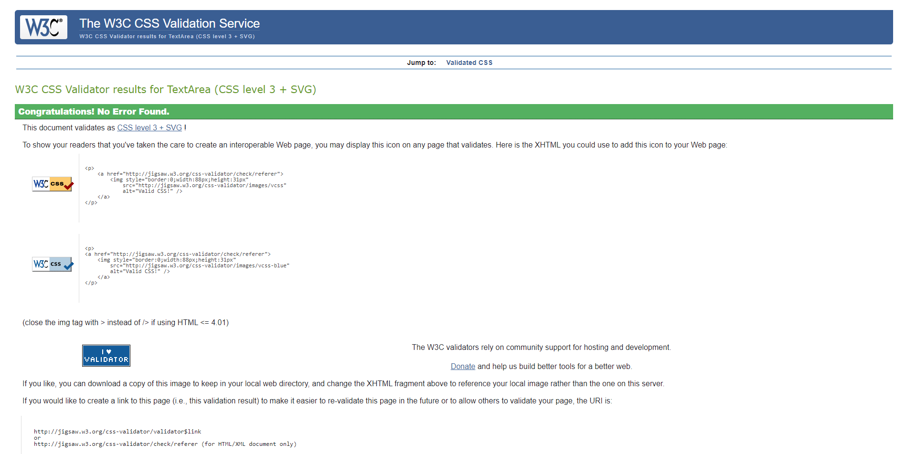

---

### JavaScript

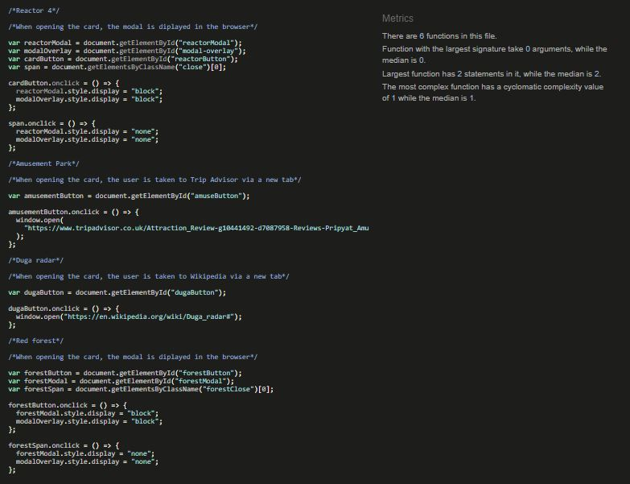
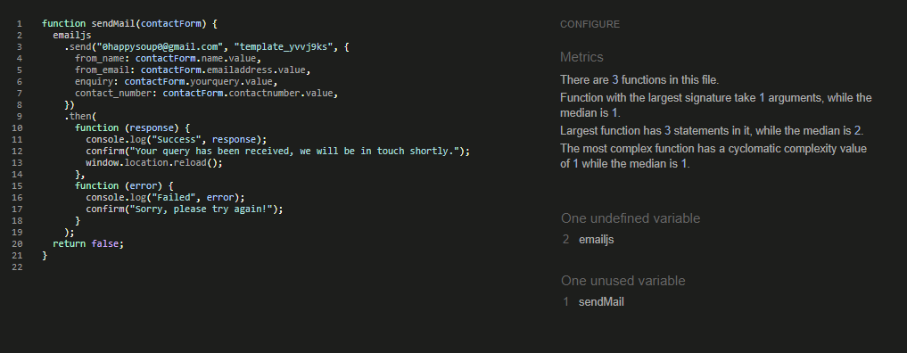

- When validating the Javascript in sendEmail.js it warns that the variable 'sendMail' is unused, however the variable is used in the HTML on the contactus.html page

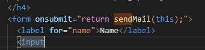

## Testing User Stories from User Experience (UX) Section

## First Time Visitor Goals

- As a first time user, I want to visit the site and know quickly what the purpose of the site is
  - The site looks clean and attention is directed towards the header which shows the user the site's logo and then onto the opening paragraph which explains the purpose of the site
  - The site is simple and easy to navigate
- I want to be able to easily navigate around the site from any page without much(if any scrolling) or searching
  - The navigation bar is sticky so follows the user as they scroll down the page, this means the user can navigate to any page on the site no matter where they currently are on the site
- I want to be able to find out brief information about Chernobyl and Pripyat before enquiring further without being bombarded with information as the main purpose of the site is for booking a bespoke trip
  - The cards on the index page give brief information about 4 of the main sites around Chernobyl and Pripyat, each card contains a modal or links away from the site(opening in a new window) if the user wishes to learn more
  - Just for fun, there is a short quiz page if the user wishes to test their knowledge based on the information provided on the index page
- I want to enquire about a bespoke a trip without being limited to pre-set options i.e. pre-set route of tour
  - The contact us form allows the user to write up an enquiry without any limitations, they must provide their name, email address and contact number along with the enquiry
- I want confirmation that my query has been receieved by the operator when completely the enquiry form
  - Once the user has completed the form and clicks 'submit', a window will pop-up telling the user whether the submission has been successful or whether it has been unsuccessful and will need to be resubmitted

## Returning Time Visitor Goals & Frequent Time Visitor Goals

- Due to the nature of the site I feel it is unlikely that a user would return to or become a frequent visitor to the site
  - Should a user re-visit the site, I think the simple layout of the site means there will be no confusion about the purpose or how to navigate the site

## Further Testing

- When testing the site, I utilised Google’s Developer Tools and looked at the responsiveness of the site across many mobile device sizes within the tool, I have used media queries to ensure that the site is responsive regardless of the screen size, for example, stacking the cards on the index page and removing the card images on smaller resolutions to avoid the page looking too crowded
- I have tested the site using different browsers such as Google Chrome, Mozilla Firefox & Microsoft Edge
- After deployment, I viewed the site live on my Huawei P20 Pro, Samsung S20+ & Samsung S3 tablet
- I spent time testing of all the links on the site to ensure none were broken, all open in separate windows(where intended) and went to the correct destination

---

# Bugs/Known Issues

- When opening the contact page, I found that the JS for the form submission was triggered as soon as the DOM loaded(and subsequently sending an empty email to my linked email.js account each time the page is opened). However, an email was also sent when the form was completed and filled out. I was unable to resolve this, and after deployment, the contact page continues to send a blank email.js whenever the contact page is loaded(I raised this with Code Institute but was unable to find a resolution to this)
- Following my initial submission, my subscription to Google Platform has expired meaning the map on the page is greyed out - unfortunately, I cannot rectify this without paying for a subscription

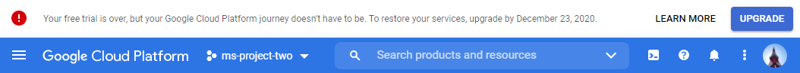

# Resolved Issues

- I have rectified a parse error with my HTML and removed the use of 'iframe border' from my CSS, HTML and CSS both pass through validators with no errors
- Google maps was overlapping the navigation bar when scrolling to the bottom of the index page, adding a Z-index to the navigation bar rectified this
- When testing the quiz, I found I had accidentally set the value of two of the answers to 'true' though there is only one correct answer per question - this was easily rectified by changing the value of the incorrect answer to 'false'

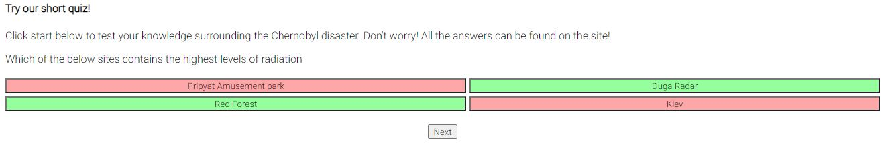

# Deployment

## GitHub Pages

As with my first milestone project, I had the same issue whereby, after deployment, I had the revise all of the image file paths and CSS links as these were not relative and did not work correctly when deployed.

- When beginning development, I created a repository to store the project and a clone on GitHub desktop, this way when commiting the changes are commited to the correlating clone
- I made sure to commit and push frequently throughout development and use informative messages when commiting
- I deployed the site using GitHub pages, with help from [GitHub Pages's guide](https://pages.github.com/):
- Deploying the site involves:
  - Navigating to the settings of my repository on the GitHub website
  - Ensuring the repo's visibility is set to public
  - Choosing a source from which the site will be built, I chose to build from the master branch and saving
  - GitHub now alerts me to the fact my site is now published via GitHub Page at (https://chloe-o.github.io/ms-project-two/)

---

# Credit

- [DCode Youtube Channel](https://www.youtube.com/channel/UCjX0FtIZBBVD3YoCcxnDC4g) Navigation bar tutorial
- [Pixabay](https://pixabay.com/) Stock images
- Photos of my own(Duga Radar, Red Forest)
- [Freelogodesign](https://www.freelogodesign.org/) Logo for site
- [W3schools](https://www.w3schools.com/) CSS Grid, JavaScript Modals
- [Font Awesome](https://fontawesome.com/) for icons used on the site
- [Google Fonts](https://fonts.google.com/) Roboto font
- Tim @ Code Institute for info regarding CSS Grid
- [Wikipedia](https://www.wikipedia.com) Further information regarding Chernobyl and Pripyat
- [Weddev Simplified Youtube Channel](https://www.youtube.com/watch?v=MBaw_6cPmAw) Guidance for modals and quiz
- [Paper Crane](https://www.youtube.com/watch?v=X4t0JxiBeO0&t=239s) Video modal responsive styling

---
