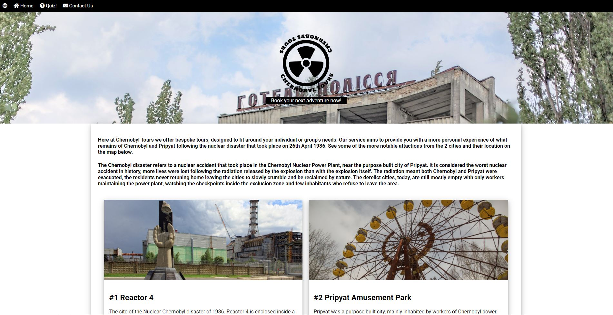

# Chernobyl Tours

For this project, I have used HTML, CSS & Javascript(and no external libraries/frameworks) to put together a site that specialises in bespoke tours to the Chernobyl and Pripyat areas.

[Link to my deployed site with GitHub Pages](https://chloe-o.github.io/ms-project-two/)

---

## UX

I have tried to keep the site quite simple and 'straight forward', I feel the layout is self explanatory and easy to navigate. I have included properties such as a pointer cursor and hover over clickable buttons to provide visual feedback.

## Technologies Used

Languages and framework used for this site:

- [JavaScript](https://www.javascript.com/)  
  Used to add interactivity to the site, for Google Maps and Email.js

- HTML & CSS  
  Used for the basic structure of the site and some styling

---

## Testing

- When testing the site, I utilised Google’s Developer Tools and looked at the responsiveness of the site across many mobile device sizes within the tool, I have used media queries to ensure that the site is responsive regardless of the screen size, for example, stacking the cards on the index page and removing the card images on smaller resolutions to avoid the page looking too crowded
- I have tested the site using different browsers such as Google Chrome & Microsoft Edge
- After deployment, I viewed the site live on my Huawei P20 Pro, screenshot below

- I have run my code through HTML, CSS & JS validators with no serious issues

---

## Bugs/Known Issues

- When scrolling on index page, the Google map window would overlap the navbar. To resolve this, I added the Z-index property to the navbar so it appears in front of all the other elements on the page.
- When opening the contact page, I found that the JS for the form submission was triggered as soon as the DOM loaded(and subsequently sending an empty email to my linked email.js account). However, an email was also sent when the form was completed and filled out. I was unable to resolve this, and after deployment, the contact page continues to send a blank email.js whenever the contact page is loaded.
- I was unable to get the 'x' button on the modal to align correctly within the container
- The form on the contact page aligns to the centre of the page on smaller screens but sits to the left of the page on a large desktop. I spent a lot of time looking for a resolution and trying different properties to make them align centrally but was unable to achieve this, unfortunately

---

## Deployment

I deployed the site using GitHub pages, with help from [GitHub Pages's guide](https://pages.github.com/).
As with my first milestone project, I had the same issue whereby, after deployment, I had the revise all of the image file paths and CSS links as these were not relative and did not work correctly when deployed.

---

## Credit

- [DCode Youtube Channel](https://www.youtube.com/channel/UCjX0FtIZBBVD3YoCcxnDC4g) Navigation bar tutorial
- [Pixabay](https://pixabay.com/) Stock images
- Photos of my own(Duga Radar, Red Forest)
- [Freelogodesign](https://www.freelogodesign.org/) Logo for site
- [W3schools](https://www.w3schools.com/) CSS Grid, JavaScript Modals
- [Font Awesome](https://fontawesome.com/) for icons used on the site
- [Google Fonts](https://fonts.google.com/)
  Tim @ Code Institute for info regarding CSS Grid
  [Wikipedia](https://www.wikipedia.com)Further information regarding Chernobyl and Pripyat
- [Weddev Simplified Youtube Channel](https://www.youtube.com/watch?v=MBaw_6cPmAw) Modal styling
  [Paper Crane](https://www.youtube.com/watch?v=X4t0JxiBeO0&t=239s) Video modal responsive styling

---
